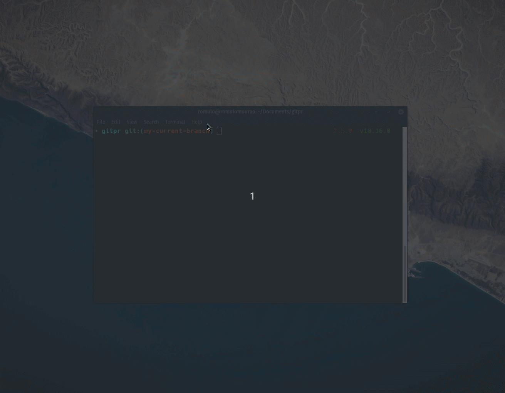

# Gitpr

- This package open the github's comparison page between current branch and the target branch.

## Installation

`pip install gitpr`

## Usage

`gitpr` *`<target_branch>`*

E.g.:
 > `gitpr master` - This will open the Github page with a comparison between master and your current branch .

